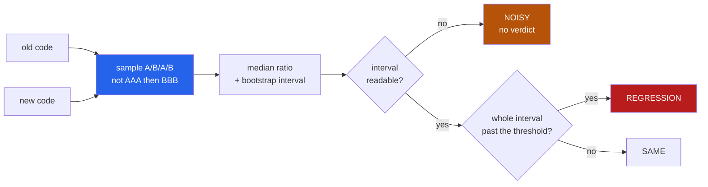

<h1 align="center">perf-hunter (Python · permutation test · bootstrap · zero deps)</h1>
<p align="center"><i>A performance gate is only worth having if you know how often it cries wolf. So measure that first.</i></p>

<p align="center">
  <a href="#the-through-line">The through-line</a> &middot;
  <a href="#the-result">The result</a> &middot;
  <a href="docs/RESULTS.md">Full results</a> &middot;
  <a href="#how-it-works">How it works</a> &middot;
  <a href="#run-it">Run it</a> &middot;
  <a href="#what-this-does-not-do">What it does NOT do</a> &middot;
  <a href="#problems-hit-while-building-this">Problems hit</a>
</p>

<p align="center">
  <a href="https://github.com/hammasbuilds/perf-hunter/actions/workflows/ci.yml"></a>
  
  
  
  
  <a href="LICENSE"></a>
</p>

---

## The through-line



Every performance gate can tell you it found a 7% regression. Almost none can tell you how
often it says that when **nothing changed at all** — and that number decides whether anybody
should let it fail a build.

It is measurable, and it needs no ground truth: run the same function against *itself*. Every
regression reported is wrong by construction.

## The result

Five workloads, identical code on both sides, 200 trials per schedule. **Every alarm here is
a false alarm.**

| sampling schedule | trials | false alarms | rate | worst reading |
|---|---:|---:|---:|---:|
| `sequential` — all of A, then all of B | 200 | **13** | **6%** | **+104.2%** |
| `interleaved` — A, B, A, B | 200 | **0** | **0%** | +15.1% |
| `paired` — A and B per round, order shuffled | 200 | **0** | **0%** | +22.7% |

Sampling one version to exhaustion and then the other reported a **104% slowdown on code
that had not changed**. Everything that drifts on a machine — thermal throttling, another
process starting, the allocator's arena growing — drifts *between* those two blocks and
lands entirely on one side. No amount of statistical care recovers from it: the test is
handed a real difference, it just is not a difference about the software.

Interleaving fixes it by construction, and the fix is worth more than the statistics.

### And what it can actually see

| asked for | actually injected | trials | detected | **missed** |
|---:|---:|---:|---:|---:|
| 1% | 2.9% | 60 | 30% | 32 |
| 2% | 0.9% | 60 | 32% | 36 |
| 5% | 7.1% | 60 | 38% | 17 |
| 10% | 12.3% | 60 | 60% | 12 |
| 25% | 28.9% | 60 | 62% | **0** |

**At a real 29% slowdown it missed nothing** — but it only *called* 62% of them. The other
38% were reported `NOISY`: the interval was too wide to say anything, so it refused rather
than guessing. That is the designed behaviour, and it is why "detected" and "missed" are
separate columns.

This machine was busy while the numbers were taken — a GPU job and three dozen other Python
processes. That is why so much came back unreadable, and it is closer to a shared CI runner
than a quiet laptop would be. The condition is recorded with the results rather than tidied
away.

**Small regressions are not detectable here at all.** A 1–2% change is inside this machine's
noise, and the honest report is a wide interval, not a verdict.

## How it works

**The median, not the mean.** Timings have a floor — the code cannot run faster than it can
run — and a long right tail of interruptions. The mean sits inside that tail.

**A permutation test, not a t-test.** If the labels "before" and "after" meant nothing, how
often would shuffling them produce a difference this large? Computed by actually shuffling,
with no assumption about distribution shape.

**A bootstrap interval, because the question is "how big".** With enough samples every
difference is significant. A 0.3% regression with an interval of 0.1%–0.5% is real,
measurable, and not worth anybody's afternoon.

**The threshold is applied to the interval, not the point estimate.** A regression has to be
at least `--threshold` big at the *conservative* end of the interval. Gating on `p` alone
fails every build, gets muted within a week, and then catches nothing.

**`NOISY` is a distinct verdict.** A p-value cannot tell "no difference" from "no
information", and on a loaded machine the second is the common case. A gate that reports
`SAME` when it means `NOISY` is a green tick nobody earned.

## Run it

```bash
git clone https://github.com/hammasbuilds/perf-hunter
cd perf-hunter
uv venv && uv pip install -e ".[dev]"

# how often does it cry wolf on THIS machine? run this before trusting anything below
perf-hunter self-check

# a file of bench_* functions, this revision against a git ref
perf-hunter compare benchmarks/bench_core.py --before origin/main
perf-hunter compare benchmarks/bench_core.py --before HEAD~1 --fail-on-regression
perf-hunter run benchmarks/bench_core.py          # just time them
```

`compare` reads the old side with `git show`, so it never touches the working tree. Needs no
model, no API key, no runtime dependencies — the permutation test and the bootstrap are about
twenty lines each, and pulling in numpy to run them would be the tail wagging the dog.

## Layout

```
src/perf_hunter/
  timing.py     batching, warmup, and holding the collector off
  schedule.py   sequential / interleaved / paired - and why it decides more than the stats
  stats.py      permutation test and bootstrap interval, in stdlib
  verdict.py    four answers, only one of which should fail a build
  workloads.py  five unalike benchmarks, and a known-size slowdown to inject
  bench.py      measure the measurer: false alarms, then power
  report.py     the interval beside every verdict
```

## What this does NOT do

- **It cannot detect a 1% regression on a busy machine.** Nothing can. The honest output is
  a wide interval and a `NOISY` verdict, and this reports that instead of a coin flip.
- **The numbers above are this machine's**, under load, on this Python. Run `self-check` on
  your own CI runner; a false-alarm rate is a property of the hardware, not of the tool.
- **It compares one file against one git ref.** It is not a history, a database, or a
  dashboard, and it will not tell you when a regression was introduced.
- **A suite needs a correction.** Fifty benchmarks at a 5% false-alarm rate produce two and a
  half alarms per run on identical code. `expected_false_alarms()` prints that beside the
  real count, because "3 regressions out of 50" means nothing without it.
- **Wall-clock only.** No memory, no allocation counts, no instruction counts. An
  instruction-count comparison is far less noisy and answers a different question.
- **Benchmarks must be zero-argument callables named `bench_*`** in an importable file, and
  they are imported, so module-level cost is paid once and is not measured.
- **The injected slowdowns are synthetic.** They repeat the same work rather than doing
  something new, so they perturb only duration — not cache behaviour, not allocation
  patterns. A real regression is often worse than its percentage suggests.

## Problems hit while building this

- **The first schedule comparison rested on one false alarm out of 30.** Sequential showed
  3%, interleaved 0%, and it would have been easy to write that up. At 200 trials per
  schedule the real gap is 6% against 0% — the same conclusion, but the first version had no
  business claiming it.
- **The power curve was labelled with numbers that were not true.** Asking for a 1% slowdown
  produced 2.9%, and asking for 2% produced 0.9%: the wrapper's own bookkeeping is a large
  share of a 1% target, and it varies per workload. The benchmark now measures what the
  injection *actually* cost, separately and at greater length, and reports power against
  that.
- **A test asserted something that could never fail.** `assert a != b or True` passes
  whatever happens. It was checking that different seeds give different orders — which two
  seeds can violate by chance, so the honest version tests reproducibility only.
- **The permutation test looked broken and was not.** A fixture of thirty `1.0`s against
  thirty `5.0`s makes the median a step function: any split other than exactly 15/15 puts
  both halves at opposite extremes, so nearly every shuffle reproduces the full difference.
  The test was measuring its own fixture.
- **Two benchmark runs raced on the same output file**, interleaving their progress lines
  into nonsense. The JSON survived intact and the report is rebuilt from it.

## Also worth reading

| | |
|---|---|
| &#128202; **[Results](docs/RESULTS.md)** | Every schedule and effect size, with the machine it ran on |
| **[flake-detective](https://github.com/hammasbuilds/flake-detective)** | The same control-arm idea, pointed at flaky tests |
| **[test-impact-oracle](https://github.com/hammasbuilds/test-impact-oracle)** | Run only the tests a change could affect |
| **[notebook-to-package](https://github.com/hammasbuilds/notebook-to-package)** | Turn a notebook into a package, and prove it still works |
| **[suite-auditor](https://github.com/hammasbuilds/suite-auditor)** | What a passing test suite does not check |

## Keywords

benchmark &middot; performance regression &middot; continuous benchmarking &middot; CI
&middot; permutation test &middot; bootstrap confidence interval &middot; false positive rate
&middot; statistical power &middot; interleaved sampling &middot; microbenchmark

## License

MIT - see [LICENSE](LICENSE).
